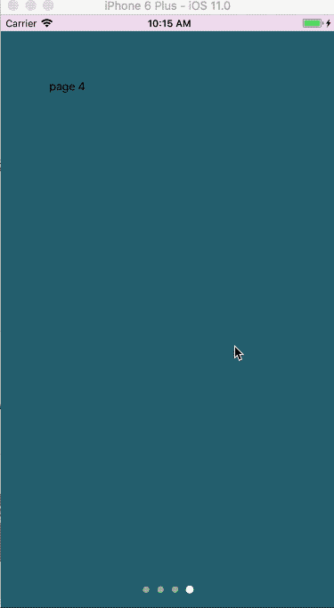
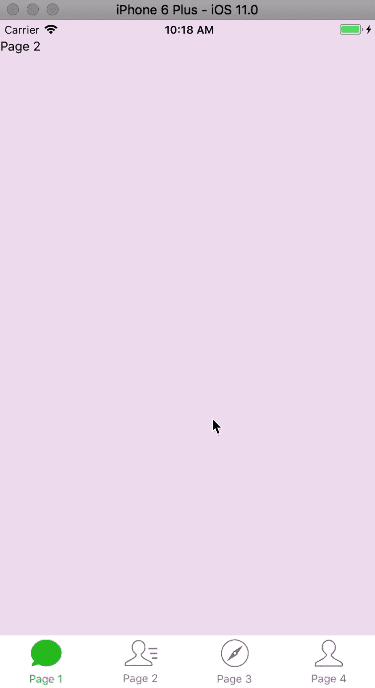

# react-native-awesome-viewpager

react-native-awesome-viewpager includes ViewPager Swiper TitleBar and TabBar,and these component are support both android and ios.

* [features](#features)
* [previews](#previews)
* [example](#example)
* [usage](#usage)
* [API Reference](#api-reference)
## Features

* implement ViewPager component on ios component,now,you can use ViewPager both on android and ios.
* implement common Swiper TitleBar TabBar.

## Previews
### Swiper Preview

### TitleBar Preview

### TabBar Preview


## example
```
cd example && npm install
```
then you can run example on your ios or android device.

## Usage

first you need to install it from npm.
```
npm install react-native-awesome-viewpager --save
```
then you can use all these

## API Reference

* [ViewPager](#viewpager)
* [Swiper](#swiper)
* [TitleBar](#titlebar)
* [TabBar](#tabbar)

*Note:Swpier TitleBar and TabBar implements all methods and props of ViewPager,and has the props below.*
### ViewPager

ViewPager's api is same to [ViewPagerAndroid](#http://facebook.github.io/react-native/docs/viewpagerandroid.html).
you can check the docs in react-native api docs.

### Swpier

#### props

##### [ViewPager props...](#http://facebook.github.io/react-native/docs/viewpagerandroid.html)
#### loop?:bool
infinite scroll views if true.
#### autoplay?: bool
auto scroll views if true.
#### interval?: number
interval
#### indicator?: bool
show dot indicator when true, dafault value is true.

### TitleBar

#### props

##### [ViewPager props...](#http://facebook.github.io/react-native/docs/viewpagerandroid.html)

#### backgroundColor?:string
TitleBar's background color,dafault is white.
#### titles:Array<string>
titles
#### renderTitle:(title,index,selectedIndex)=>ReactElement
render title item
#### borderStyle: View.propTypes.style
border indicator style


### TabBar

#### props

##### [ViewPager props...](#http://facebook.github.io/react-native/docs/viewpagerandroid.html)

#### backgroundColor?:string
TabBar's background color,dafault is white.

#### tabs: Array<{title: PropTypes.string,icon:Image.propTypes.source,selectedIcon: mage.propTypes.source}>
tabs config.
### renderTab: (tab,index,selectedIndex)=>ReactElement
render the tab item.


